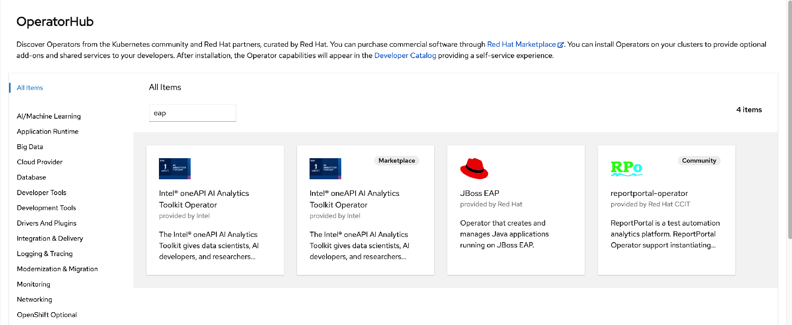
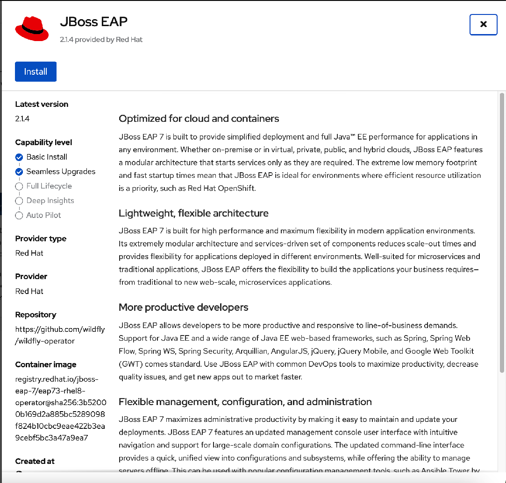
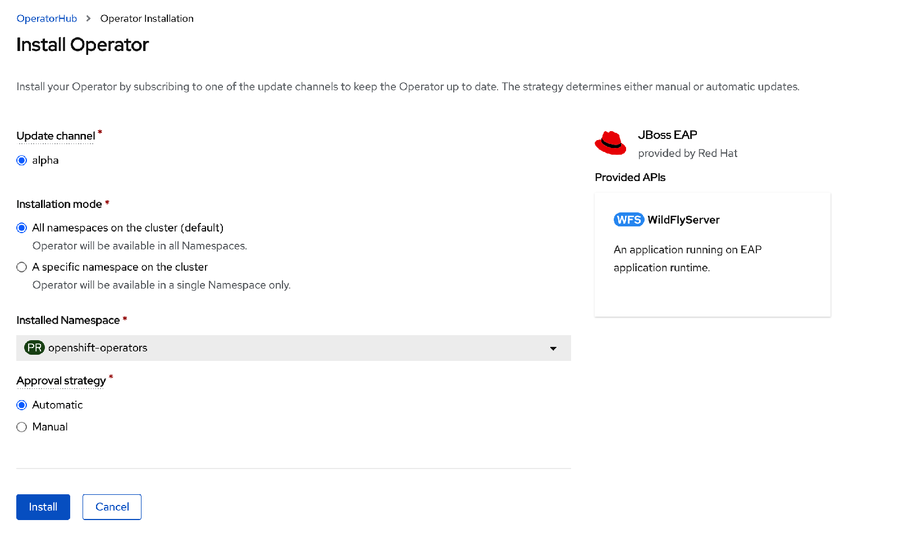
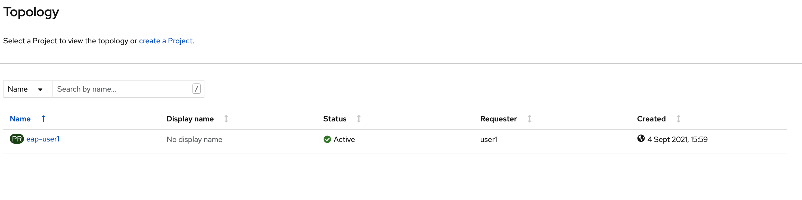
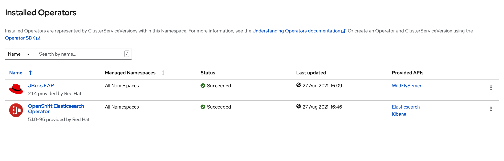

### Introduction

Red Hat EAP operator is available to create, configure, manage, and seamlessly upgrade Red Hat EAP in Openshift. The EAP operator manages multiple JBoss EAP Java application instances across the standalone cluster. It uses StatefulSet for the appropriate handling of EJB remoting and transaction recovery processing. The StatefulSet ensures persistent storage and network hostname stability even after pods are restarted.

Below are the steps to install EAP Operators as Administrator. No action required from you.  

* Navigate to `Operators` -> `OperatorHub`.  Search for `EAP`.  Click on `EAP`. 


* Click on Install.


* Accept the default value.  Click on Install. 


You will create EAP using this EAP operator. 

### Install service for next lab

* Click on the `console`.

* Switch to `Administrator` mode.  Navigate to `Home` -> `Projects`.

* There is an existing project name as `eap-%username%`.  Click on `eap-%username%`.


* Navigate to `Operators` -> `Installed Operators`.   You will see JBoss EAP operator which is installed by adminstrator. 
 

* Navigate to `Networking` -> `Services`.   Click on [Create Service]. 

* Please copy and paste the below. Click on [Create].  This service will be used for EAP servers communication in a cluster in the next exercise.

```copy
kind: Service
apiVersion: v1
spec:
    publishNotReadyAddresses: true
    clusterIP: None
    ports:
    - name: ping
      port: 8888
    selector:
        app: eap-helloworld
metadata:
    name: eap-helloworld-ping
    annotations:
        service.alpha.kubernetes.io/tolerate-unready-endpoints: "true"
        description: "The JGroups ping port for clustering."
```
### Summary
In this exercise,  we covered the steps to install EAP operator as adminstrator and create new service for the Java application deployed in the next exercise.


