### Introduction

Red Hat CodeReady Workspaces uses Kubernetes and containers to provide any member of the development or IT team with a consistent, security-focused, and zero-configuration development environment. The user experience is as fast and familiar as an integrated development environment (IDE) on a laptop. CodeReady Workspaces encodes development projects as code that is checked into the Git repository and exposed via a Uniform Resource Locator (URL) or command-line interface (CLI) command. It creates all the containers needed to run the project, clones the sources where needed, and adds development tools (such as debuggers, language servers, unit test tools, and build tools) as sidecar containers so that the running application container continually mirrors production. Users can employ the included browser-based IDE if they do not have an IDE already set up, or they can opt for a local IDE.

In this workshop,  we have deployed CodeReady Workspace in Openshift Cluster for attendees to experience how easy to develop services and deploy it into openshift cluster. 

In this exercise,  you will be deploying a sample java servlet applicaton to configure EAP as standalone cluster with 2 EAP standalone servers. The sessions are replicated between these 2 EAP standalone servers. 

In order to replicate the session, the `<distributable/>` is included in the web.xml. 

### Deploy existing application from GitHub.  

* Open a new browser tab with the url as [CodeReady Workspace](https://codeready-openshift-workspaces.apps.cluster-cf1a.cf1a.sandbox824.opentlc.com/).  Login as `%username%` and password as `openshift`.

* Click on [Allow selected permissions].

* Key in your email address, first name and last name.  Click on [Submit].
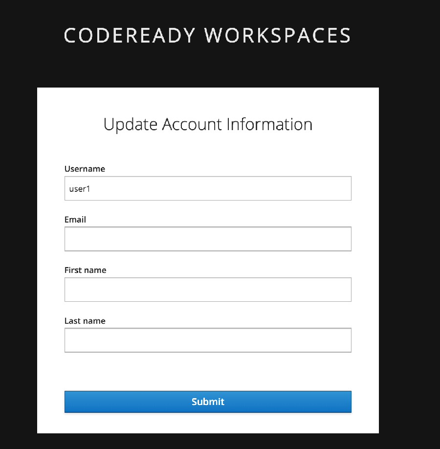

* Enter `https://github.com/likhia/eap73-ocp-helloworld.git` for `Git Repo URL`. Click on [Create & Open].   This will take a few mins to open the workspace. 
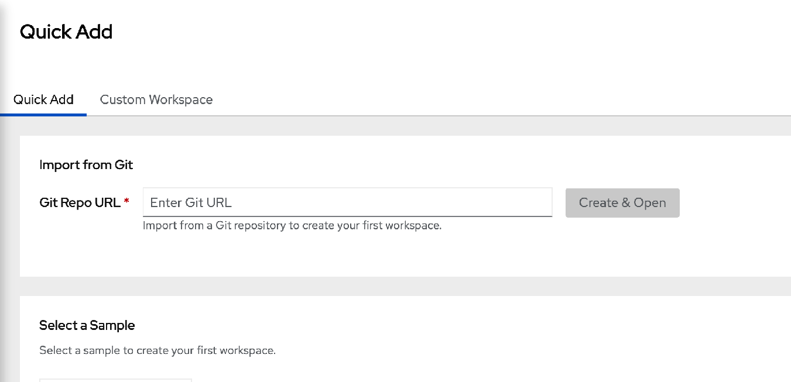
 
* If you encounter error message as shown below, please inform the instructor / lab assistant to fix this for you. 


* If you see any pop up messages,  just close them. 

### Build Application Image

* Navigate to src/main/java/org.jboss.as,quickstarts.helloworld.HelloWorldServlet.java.   This is a servlet class that will keep counter in the session. As long as the session is valid,  the counter keep increment.    
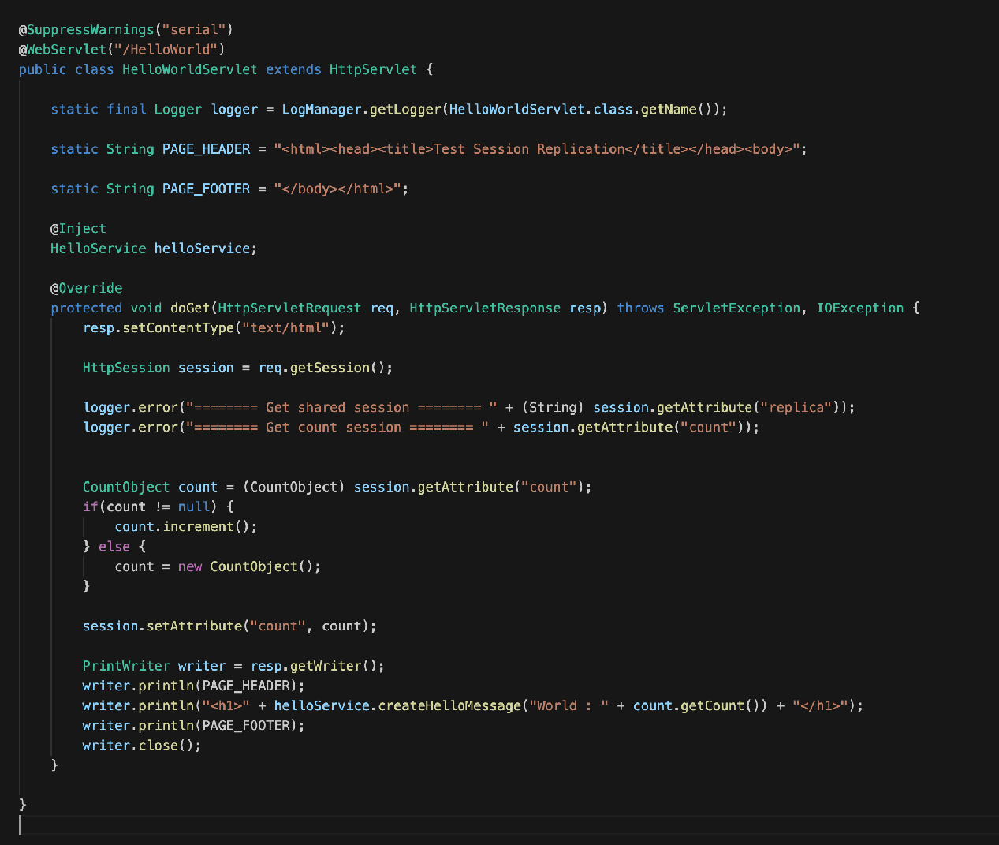

* Click on the box icon on the right.  Click on `Build` to build the application.  This might take a few minutes. `Build Successful` will be showed in the Terminal if successful.   If you encounter error,  please check with the instructor or lab assistant.
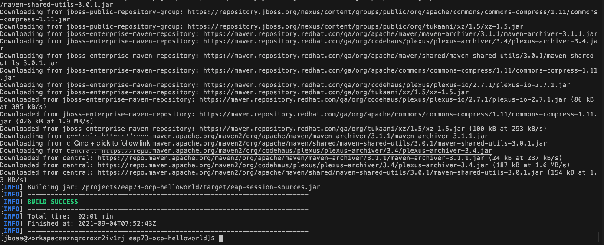

* Click on `New terminal` to open new terminal to build application image.     

* Please copy and paste the commands below to connect to the current Openshift cluter.  Type in `y` when prompt. 
```copy
oc login https://api.cluster-cf1a.cf1a.sandbox824.opentlc.com:6443 -u %username% -p openshift
```
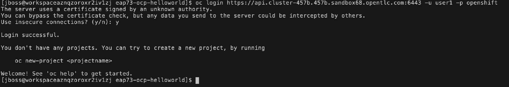

* Please copy and paste the commands below to navigate to your project.
```copy
oc project eap-%username%
```

* Please copy and paste the commands below to create a application image.   
```copy
oc new-build --name=eap-helloworld  --binary --image-stream=jboss-eap73-openjdk11-openshift:7.3 \
	-e MAVEN_MIRROR_URL='http://nexus-nexus.apps.cluster-cf1a.cf1a.sandbox824.opentlc.com/repository/maven-public/'
```
```copy
oc start-build eap-helloworld  --from-dir=.  --follow
```
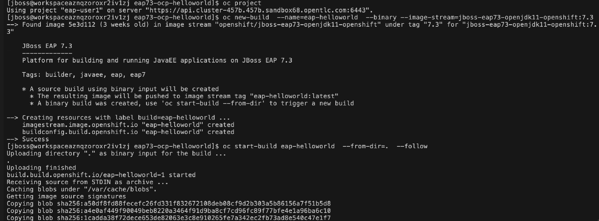

* Please wait for a few mins till you see below. 
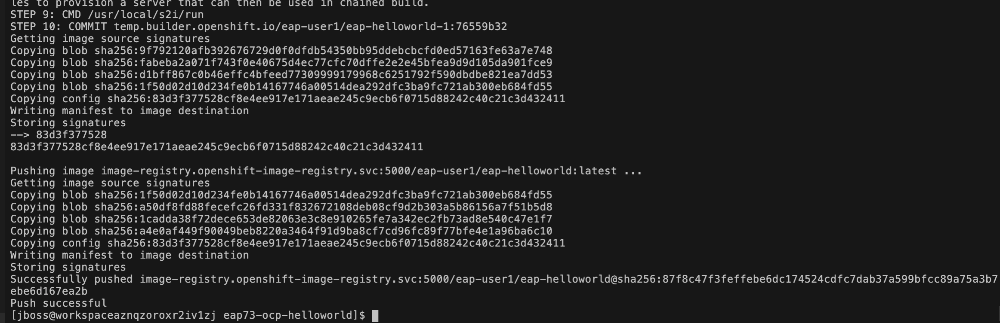

* Go back to the workshop page. Click on `Console`.  Go to `eap-%username% project`.  Navigate to `Builds` -> `ImageStreams`. 
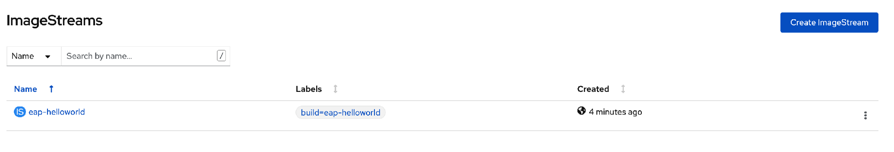 

* Click on `eap-helloworld`. This image will be used to deploy in EAP in the next few steps.  
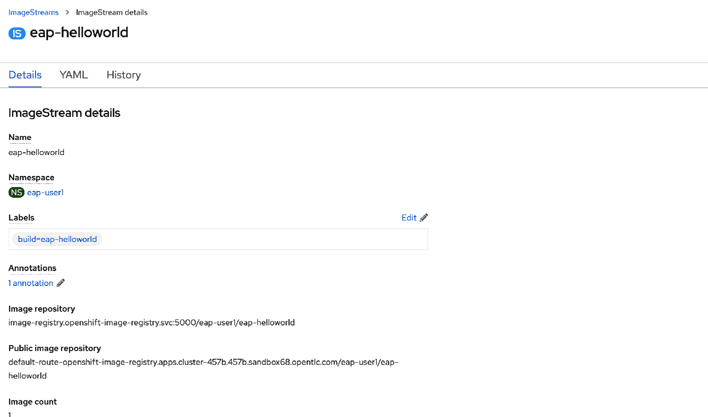

### Deploy Application in EAP operator

* Navigate to `Operators` -> `Installed Operators`.  Click on `JBoss EAP`.  Click on `WildFlyServer` tab.
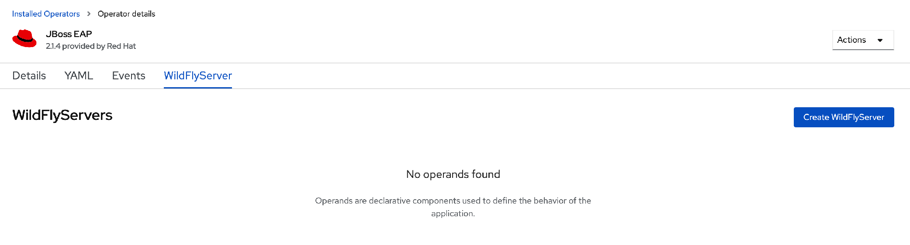

* Click on [Create WildFlyServer].

* Click on `Yaml View`.  Copy and paste below and click on [Create]. This will use the earlier generated image with the environment variables below to run this application in 2 standalone servers in a cluster. 

```copy
apiVersion: wildfly.org/v1alpha1
kind: WildFlyServer
metadata:
  labels:
    app: eap-helloworld
  name: eap-helloworld
  namespace: eap-%username%
spec:
  applicationImage: >-
    image-registry.openshift-image-registry.svc:5000/eap-%username%/eap-helloworld:latest
  env:
    - name: JGROUPS_PING_PROTOCOL
      value: dns.DNS_PING
    - name: OPENSHIFT_DNS_PING_SERVICE_NAME
      value: eap-helloworld-ping
    - name: OPENSHIFT_DNS_PING_SERVICE_PORT
      value: '8888'
  replicas: 2
```
* If there is error message after clicked on [Create], please check the alignment of this yaml is shown as below. 
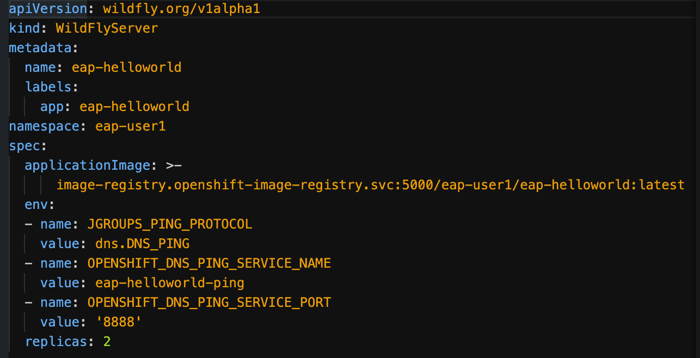

* To enable JBoss EAP clustering on OpenShift, configure the JGroups protocol stack in your JBoss EAP configuration to use either the `kubernetes.KUBE_PING` or the `dns.DNS_PING` discovery mechanism.

* Please note that the value of `OPENSHIFT_DNS_PING_SERVICE_NAME` is the name of service that is created in earlier exercise. 

* Navigate to `Workloads` -> `Pods`.  You will see 2 pods running for this application.  Please wait for them to be ready.   
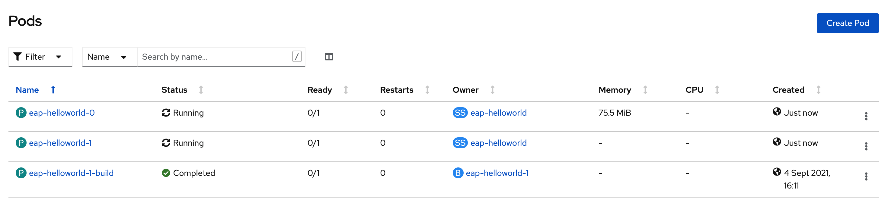

* If any / both pods cannot be started, it can be due to resource limit.  
  * Navigate to `Administration` -> `LimitRanges`.  
  * `eap-%username%-core-resource-limits` is the default limit range that is created by default.  The user is assigned with cluster-admin role for this eap-%username% project so that the user is able to create reource quota and limit range.
  * Click on `eap-%username%-core-resource-limits`.  Click on `YAML` tab.  Change the `cpu` of `default` and `defaultRequest` to '1'. 
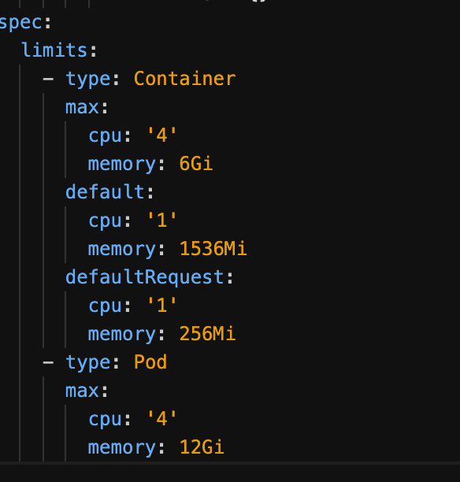

* Navigate to `Workloads` -> `Pods`.  Delete the pod that is having issue.  Wait till the pod runs successful.  

* Navigate to `Networking` -> `Route`.  Click on the `Location`. 
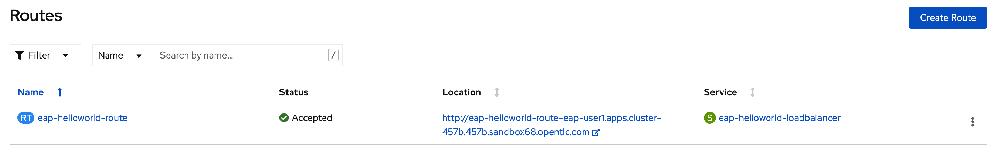

* You will see the number increases as refresh browser.
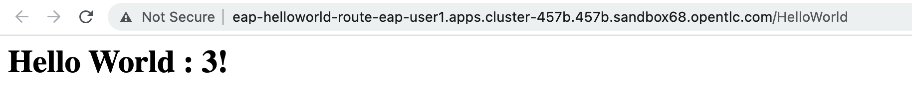

### Test Session Replication

* Navigate to `Workloads` -> `Pods`.  Click on any of the eap-helloworld-* pod. Click on `Log` tab.  Find the one with the logging as shown below.    
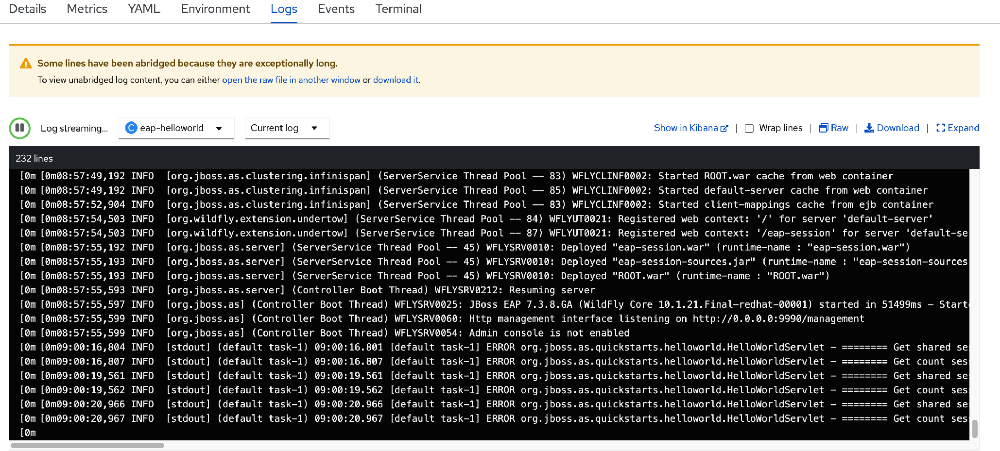

* Please delete the pod with the `Get shared session` in the log.  This is to test if the session is replicated in another pod.  Click on `Actions` -> `Delete Pod`. The pod will be auto-create as the replicas is set as 2.  
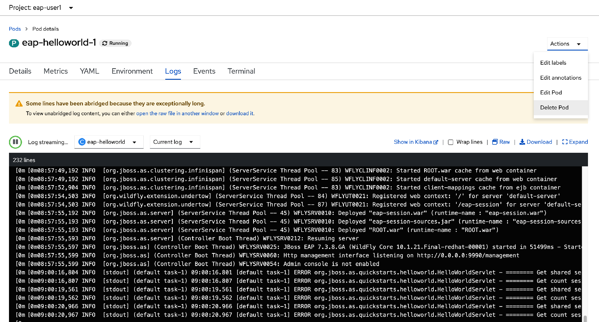

* Refresh your browser while the deleted pod is creating and you will see the counter continue. 

* Go back to your console.  You will see the pod has restarted after a while. 

### Note

* If you encounter error message as shown below, please inform the instructor / lab assistant to fix this for you. 

 
### Summary
In this exercise, you have learned to 

* Build application image for java application to deploy in Red Hat EAP. 
* Deploy the application image on EAP using operator.
* Configure standalone cluster with at least 2 EAP standalone servers. 
* Configure LimitRanges which restricts resource consumption in a project.

