### Introduction

It is very common that application need to interface with database for storing and getting data.   

In this lab,  you will deploy a sample Java application that is using Java API and Hibernates to interface with MySQL database.   The MySQL database is running in the `common` project/namespace in the same Openshift cluster so the Java application use `service` of MySQL to call the database.  `MySQL.common.svc.cluster.local` is the hostname of MySQL.  

### Deploy existing application from GitHub.

* Return the CodeReady Workspace if it is still open.  If no, open a new browser tab with the url as [CodeReady Workspace](https://codeready-openshift-workspaces.apps.cluster-cf1a.cf1a.sandbox824.opentlc.com/).  Login as `%username%` and password as `openshift`.

* If the `eap73-ocp-helloworld` is still running,  click on the `>` arrow on left hand corner.  Click on `Workspaces(1)` on the left panel.  Select on 3 verticle dots of `eap73-ocp-helloworld*` and click on [Stop Workspace].   
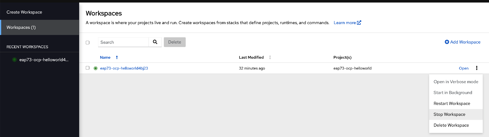 

* On the url of the browser,  change the URL to https://codeready-openshift-workspaces.apps.cluster-cf1a.cf1a.sandbox824.opentlc.com/f?url=https://github.com/likhia/eap73-ocp-db.git

* This will import the project into your workspace.   It will take a few mins. 

* If you see any pop up messages,  just close them.  

### Install Database Driver as Module in EAP

* Please note that `Support for using the Red Hat-provided internal datasource drivers with the JBoss EAP for OpenShift image is now deprecated`. 

* Please spend a few mins to read through the steps below on how  to install the driver.

* An install.sh script is responsible for customizing the base image using APIs provided by install-common.sh. install-common.sh contains functions that are used by the install.sh script to install and configure the modules, drivers, and generic deployments.   It will execute during s2i process.  It is located in root directory of the project. 
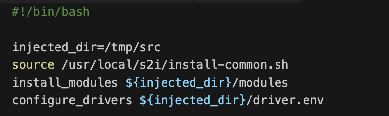
 
* Create a `modules` folder under the root directory of the project.  Create subfolders `com/mysql/main` under this `modules` folder. 
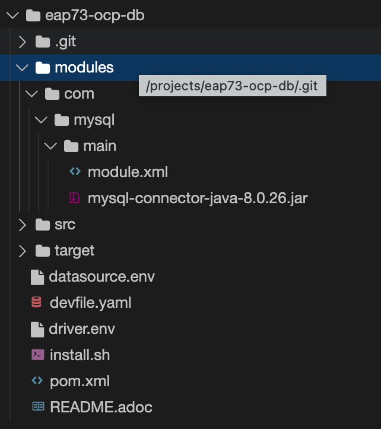  

* Add the driver's jar file and the module.xml with the content as shown below. 
```
<?xml version="1.0" encoding="UTF-8"?>
<module xmlns="urn:jboss:module:1.0" name="com.mysql">
    <resources>
        <resource-root path="mysql-connector-java-8.0.26.jar" />
    </resources>
    <dependencies>
        <module name="javaee.api"/>
        <module name="sun.jdk"/>
        <module name="javax.api"/>
        <module name="javax.transaction.api"/>
    </dependencies>
</module>
```

* Add `driver.env` under the root directory of the project. Its contents are as shown below.   
  * The value of `MYSQL_DRIVER_MODULE` is the same as name in 'module.xml' mentioned earlier. 
  * The value of `MYSQL_DRIVER_NAME` will be used to configure datasource later.  
```
#DRIVER
DRIVERS=MYSQL
MYSQL_DRIVER_NAME=mysql
MYSQL_DRIVER_MODULE=com.mysql
MYSQL_DRIVER_CLASS=com.mysql.cj.jdbc.Driver
MYSQL_XA_DATASOURCE_CLASS=com.mysql.cj.jdbc.MysqlXADataSource
```
* Just to share some information about this application.  Navigate to src/main/java/org.jboss.as.quickstarts.register.MemberRegistration.java.   This is a servlet class that will 
  * create new member record into database using Hibernate (e.g. persistence.xml)
  * retrieve the list of members using Java API (e.g. @Resource) 

* Navigate to src/main/java/org/jboss/as/quickstarts/entity folder, 
  * Member.java is the entity class.  
  * RegistrationService.java is the class that will create member into database. 

### Deploy the Application Image

* Click on `New terminal` to open new terminal to build application image.

* Please copy and paste the commands below to compile and build the project.  Please make sure that the current directory is `eap73-ocp-db`.
```copy
mvn clean package --settings ./configuration/settings.xml  
```

* Please wait till the build is successful as shown below. 
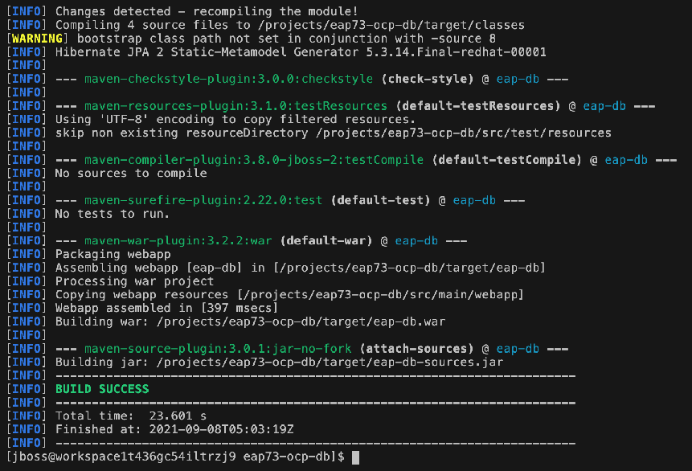

* Please copy and paste the commands below to connect to the current Openshift cluter.  Type in `y` when prompt.
```copy
oc login https://api.cluster-cf1a.cf1a.sandbox824.opentlc.com:6443  -u %username% -p openshift
```

* Please copy and paste the commands below to navigate to your project.
```copy
oc project eap-%username%
```

* Please copy and paste the commands below to create secret for database password so that no clear text is used.
```copy
oc create secret generic db-secret --from-literal=password=openshift
```

* Please copy and paste the commands below to create an image for this application to be deploy in EAP Operator. The environment variable, `CUSTOM_INSTALL_DIRECTORIES` is the directory where install.sh is located.   install.sh will be executed during the s2i process.

```copy
oc new-build --name=eap-db  --binary --image-stream=jboss-eap73-openjdk11-openshift:7.3 -e CUSTOM_INSTALL_DIRECTORIES=. -e MAVEN_MIRROR_URL='http://nexus-nexus.apps.cluster-cf1a.cf1a.sandbox824.opentlc.com/repository/maven-public/'
```

```copy
oc start-build eap-db  --from-dir=.  --follow
```


* This will take a few mins. You can check the build logs that the install.sh is executed.   
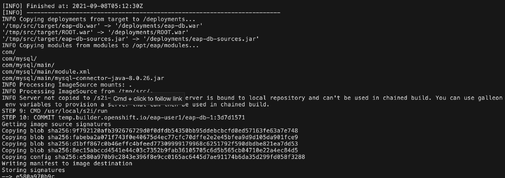

* Please wait till you see the image is pushed successful. 
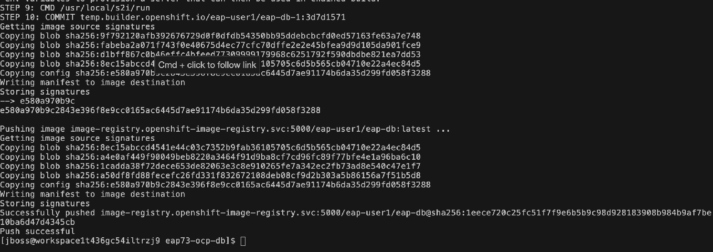

* Go back to the workshop page. Click on `Console`.  Go to `eap-%username%` project.  Navigate to `Builds` -> `ImageStreams`.


* Click on `eap-db`.  This image will be used to deploy in EAP in the next few steps.  
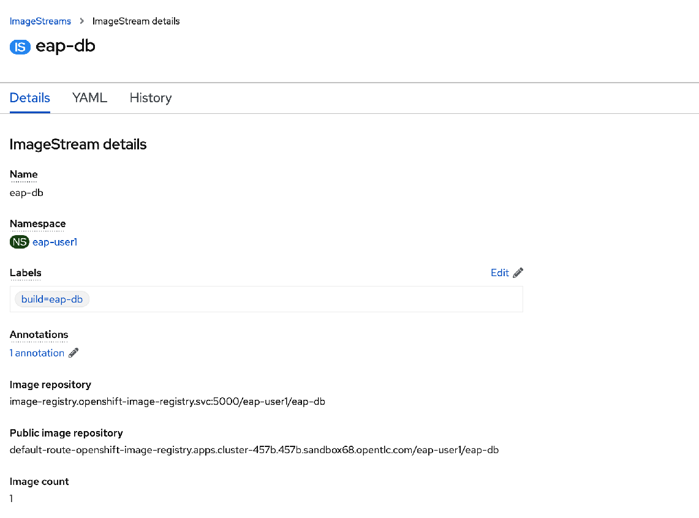

* Navigate to `Operators` -> `Installed Operators`.  Click on `JBoss EAP`.  Click on `WildFlyServer` tab.

* Click on [Create WildFlyServer].

* Click on `Yaml View`.  Copy and paste below and click on [Create]. This will use the earlier generated image with the environment variables below to run this application in a standalone servers in a cluster.  With these environment variable, the datasource with JNDI = `java:jboss/datasources/workshop-mysql` will be created. 

```copy
apiVersion: wildfly.org/v1alpha1
kind: WildFlyServer
metadata:
  labels:
    app: eap-db
  name: eap-db
  namespace: eap-%username%
spec:
  applicationImage: 'image-registry.openshift-image-registry.svc:5000/eap-%username%/eap-db:latest'
  env:
    - name: DB_SERVICE_PREFIX_MAPPING
      value: WORKSHOP-MYSQL=DS1
    - name: WORKSHOP_MYSQL_SERVICE_HOST
      value: mysql.common.svc.cluster.local
    - name: WORKSHOP_MYSQL_SERVICE_PORT
      value: '3306'
    - name: DS1_JNDI
      value: 'java:jboss/datasources/workshop-mysql'
    - name: DS1_URL
      value: 'jdbc:mysql://mysql.common.svc.cluster.local:3306/sampledb'
    - name: DS1_DATABASE
      value: sampledb
    - name: DS1_DRIVER
      value: mysql
    - name: DS1_USERNAME
      value: admin
    - name: DS1_PASSWORD
      valueFrom:
        secretKeyRef:
          key: password
          name: db-secret
  replicas: 1
  secrets:
    - db-secret
```

* If there is error message after clicked on [Create], please check the alignment of this yaml is shown as below.
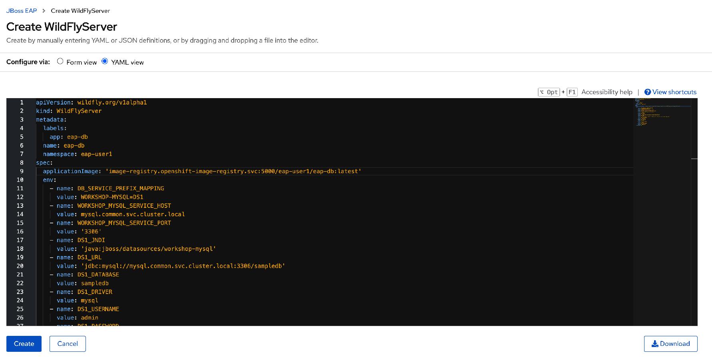

* Below explains the usage of these environment variables.
  * DB_SERVICE_PREFIX_MAPPING=`POOLNAME`-`DATABASETYPE`=`PREFIX`
  * `POOLNAME`_`DATABASETYPE`_SERVICE_HOST=The database server’s host name or IP address to be used in the datasource’s connection-url property.  `POOLNAME` and `DATABASETYPE` must be in upper case. 
  * `POOLNAME`_`DATABASETYPE`_SERVICE_PORT=The database server’s port for the datasource. `POOLNAME` and `DATABASETYPE` must be in upper case. 
  * `PREFIX`_JNDI=The JNDI name for the datasource 
  * `PREFIX`_URL=The connection URL for the datasource.
  * `PREFIX`_DATABASE=The database name for the datasource.
  * `PREFIX`_DRIVER=Java database driver for the datasource.
  * `PREFIX`_USERNAME=The username for the datasource.
  * `PREFIX`_PASSWORD=The password for the datasource.

* Navigate to `Workloads` -> `Pods`.  You will see a pod running for this application.  Please wait for them to be ready.
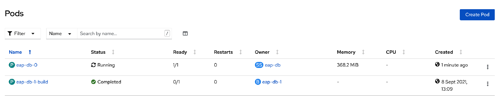

* Navigate to `Networking` -> `Routes`.  Click on Location of `eap-db-route`.  This will open a new browser tab. 

* Please enter your name, email and phone number and click on [Register].
  * Name must be between 5 to 25 characters and no number is allowed.
  * Phone Number must be between 8 to 20 characters.  
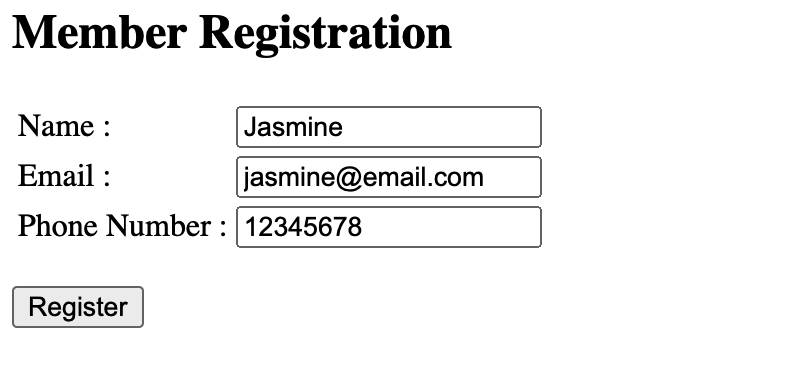

* Below page will list out all the members. 
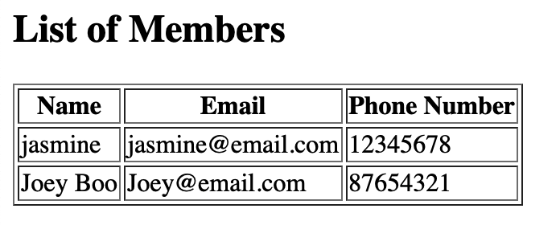

### Note

* If you encounter error message as shown below, please inform the instructor / lab assistant to fix this for you.
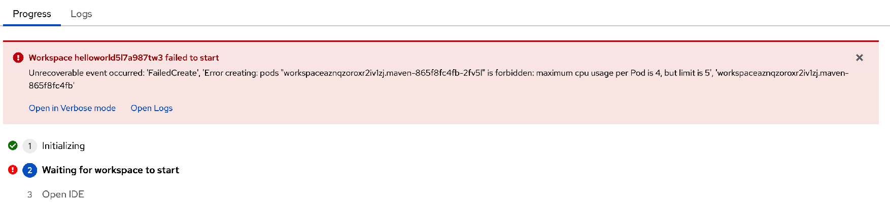

### Summary

In this exercise, you have learnt 
* Create datasource in EAP operator 
* Install database driver as module with EAP Operator. 
* Use Secret to hide clear sensitve data. 

Please refer to the links below for the more informations.
* [Environment Variable](https://access.redhat.com/documentation/en-us/red_hat_jboss_enterprise_application_platform/7.3/html/getting_started_with_jboss_eap_for_openshift_online/reference_information)
* [Install modules](https://access.redhat.com/documentation/en-us/red_hat_jboss_enterprise_application_platform/7.3/html/getting_started_with_jboss_eap_for_openshift_online/configuring_eap_openshift_image#s2i_modules_drivers_deployments)
