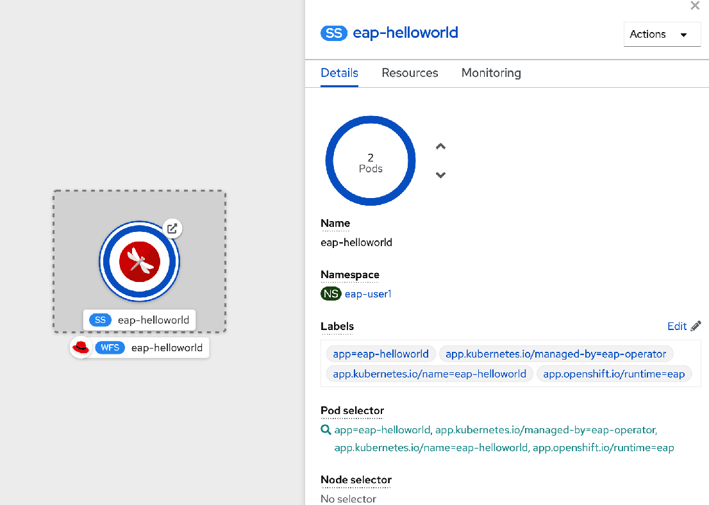
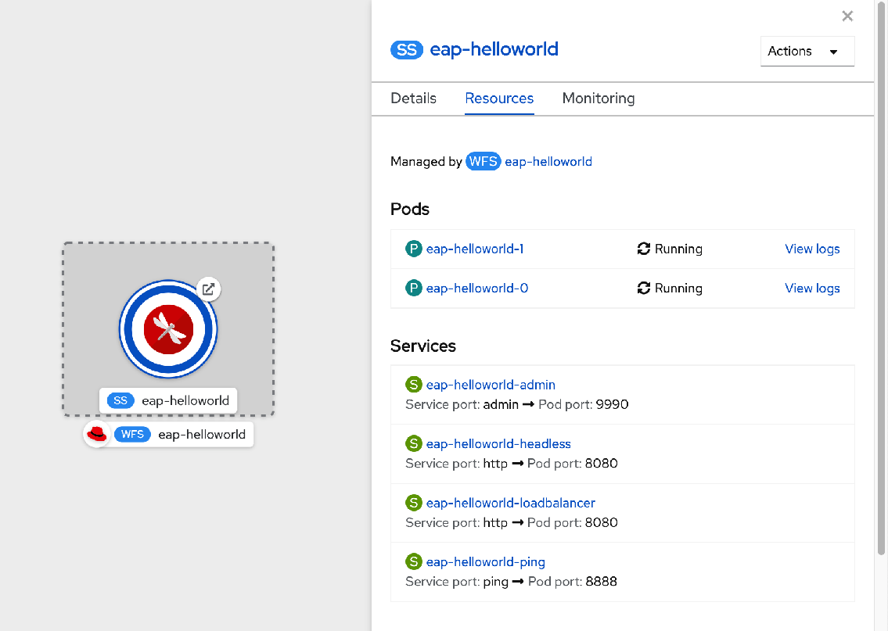
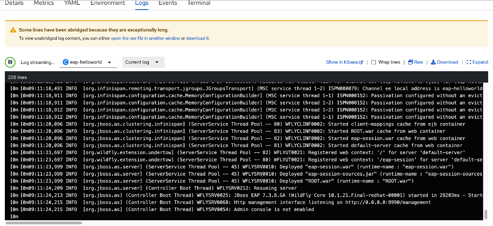
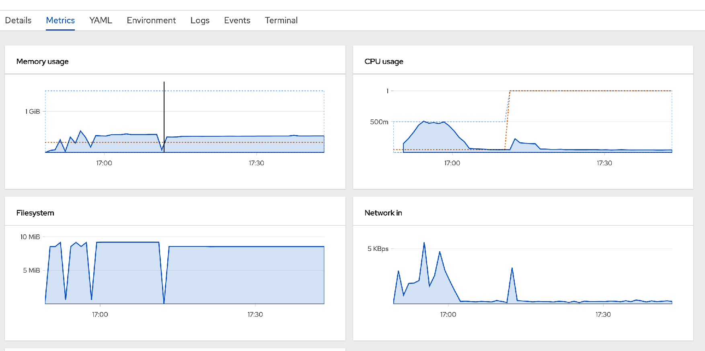
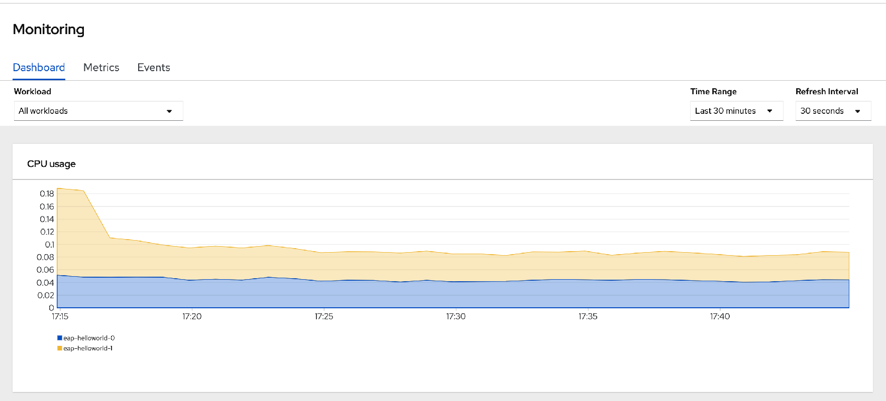
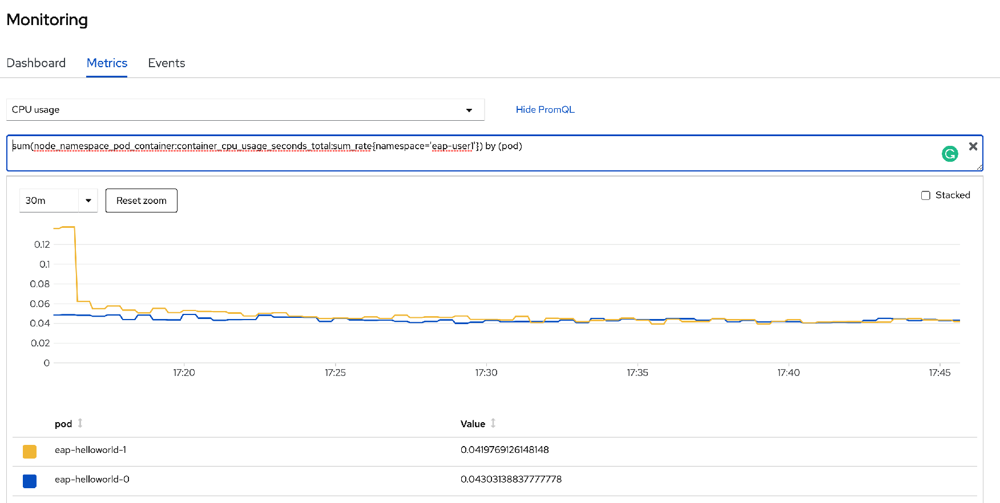
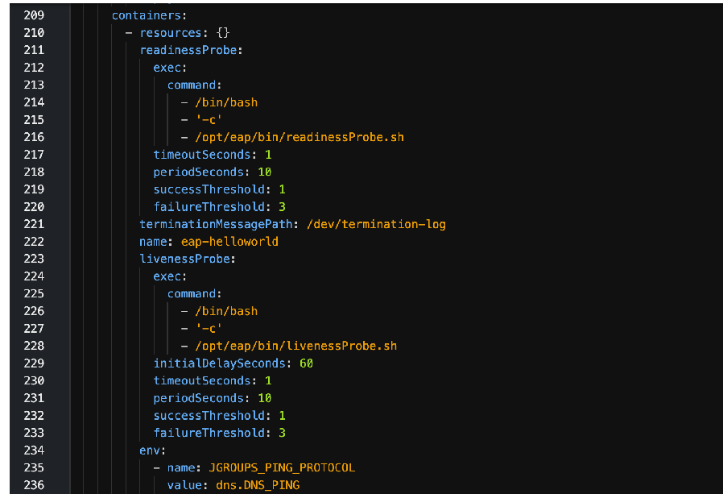

### Introduction

Developer need to monitor the application deployed and access the logs for investigating issues.   You will learn how to monitor and access log for your deployed application. 

### Monitor your application an accessing logs 

* Please open another brower tab for [Openshift Console](https://console-openshift-console.apps.cluster-cf1a.cf1a.sandbox824.opentlc.com/).  Login as `%username%` and password as `openshift`.

* Switch to `Developer` mode.  Select `eap-%username%` project.  You see the applications that you have deployed earlier.  

* Click on `eap-helloworld`.  Click on the `Details` tab. You will see the details of this deployment.  

* Click on the `Resources` tab.  You will see the pod / the build / service and route for this deployment.    

* Click on `View logs` of the pod. This is where you can view the logs of the application.

* Click on `Metrics` tab to view the Memory usage, CPU usage, Filesystem, Network In and Network out about the pod running the application. 

* Click on `Monitoring` on the left. Click on `Dashboard` tab.  You will see graphs depicting the CPU, memory, and bandwidth consumption and network related information.

* Click on `Metric` tab.  Select `CPU usage` from dropdown list.  Click on `Show PromQL`. You will see the CPU utilization for this application and also the Prometheus query for this chart.  

### Health Checks

The JBoss EAP for OpenShift image utilizes the liveness and readiness probes included in OpenShift by default.  These are auto-configured in the statefulset when create new EAP deployment. 

* Click on `Console` tab. Switch to `Administrator` mode. Navigate to `Workloads` -> `Statefulsets`.  Click on `eap-helloworld`. 

* Click on `YAML` tab.  Find `readinessProbe`.  You will see the `readinessProbe` and `livenessProbe` auto-configured. 

### Summary
In this exercise,  you have learned how to monitor application and also access the logs of your application.

* Please refer to [Health Check](https://access.redhat.com/documentation/en-us/red_hat_jboss_enterprise_application_platform/7.3/html/getting_started_with_jboss_eap_for_openshift_online/reference_information#health_checks)  
