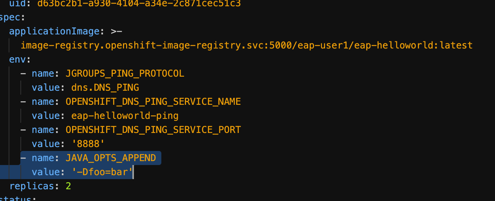
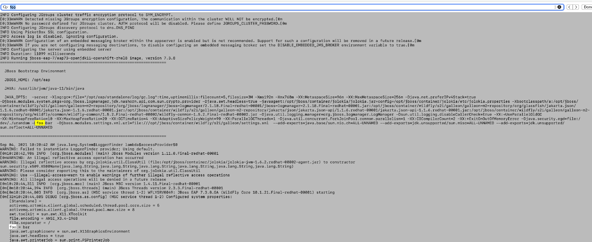
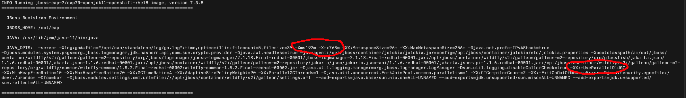
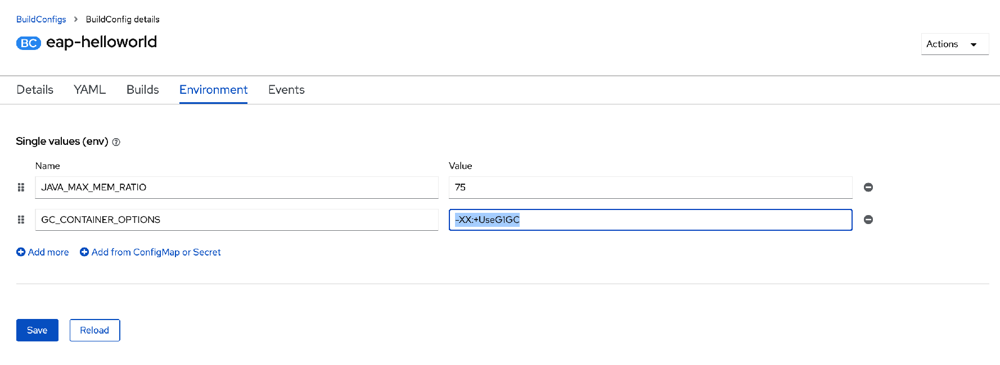
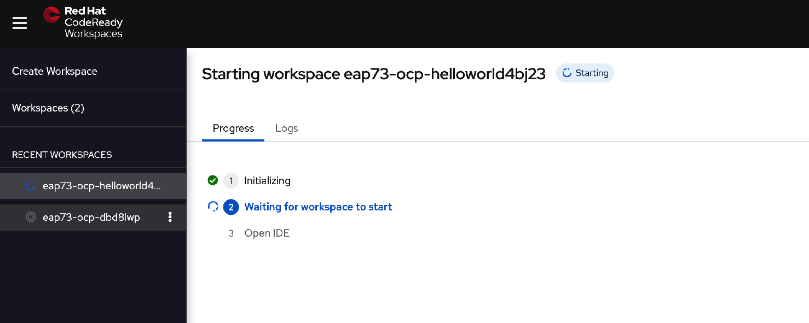
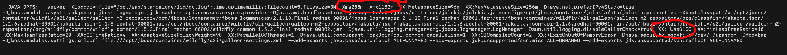

### Introduction

It is common that we need to add parameter to JVM or need to set GC or do memory tuning for JVM.   

In this exercise,  you will learn how to add parameters that will affect the JVM.  

### Add parameters to JVM

* Click on the `console`. 

* Please switch project to `eap-%username%`. 

* Navigate to `Operators` -> `Installed Operators`.  Click on `JBoss EAP`.   Click on `WildFlyServer`.   Click on `eap-helloworld`.  

* Add the below to the environment variables.
```
name: JAVA_OPTS_APPEND
value: '-Dfoo=bar'
```


* Navigate to `Workloads` -> `Pods`.   You will see the pod restarting.  

* After the pods are restarted,  click on either pod.  Click on Logs. Click on `Download` on top of the log terminal. 

* Open the downloaded file and find `foo`.  


### Configure GC Algorithm and Memory tuning 

* You can open the same downloaded log in the earlier step.  Or download the logs file again by navigating to `Workloads` -> `Pods`.   Click on any of `eap-helloworld-*`.  Click on `Logs` tab.  Click on `Download`. 

* Open the downloaded log file.  The current min and max memory are set as `-Xms192m -Xmx768m` and the GC algorithm is `-XX:+UseParallelOldGC`.   


* Navigate to `Builds` -> `BuildConfigs`.  Click on `eap-helloworld`.  Click on `Environment` tab. 

* Add the following variables as shown below. 
  * JAVA_MAX_MEM_RATIO=75
  * GC_CONTAINER_OPTIONS=-XX:+UseG1GC


* Go back to CodeReady Workspace. Stop the `eap73-ocp-db*` workspace.   

* Click on `eap73-ocp-helloworld*` workspace on the left pane.   Open a new Terminal.
 

* Please copy and paste the following commands to build the image again based on the environment variables. 
```
oc login https://api.cluster-cf1a.cf1a.sandbox824.opentlc.com:6443 -u %username% -p openshift
```
```
oc project eap-%username%
```
```
oc start-build eap-helloworld --from-dir=.  --follow 
```

* After the build is completed,  navigate to `Workloads` -> `Pods`.  Delete any of the eap-helloworld-* pod.  

* Click on the new pod and click on `Logs` tab.  Click on Downloads. 

* Open the downloaded log file.  The min and max memory have changed to `-Xms288m -Xmx1152m` and the GC algorithm is `-XX:+UseG1GC `. 


* The default memory is set as 1536Mi in limitranges.  
  * With JAVA_MAX_MEM_RATIO set as 75,  the max memory is 75% of 1536 = 1152Mi.  
  * With JAVA_INITIAL_MEM_RATIO is defaulted as 25,  the min memory is 75% * (25% * 1536Mi) = 288Mi.

* These environment variables can be added at the EAP operator too.   We are just sharing that these environment variables can be used during the build phase too.    

### Summary
In this exercise, you have learned to 
* configure JAVA Option for JVM
* set the GC algorithm and memory for JVM 

Please refer to [Environment Variables for JVM](https://access.redhat.com/documentation/en-us/red_hat_jboss_enterprise_application_platform/7.3/html/getting_started_with_jboss_eap_for_openshift_container_platform/configuring_eap_openshift_image)  
